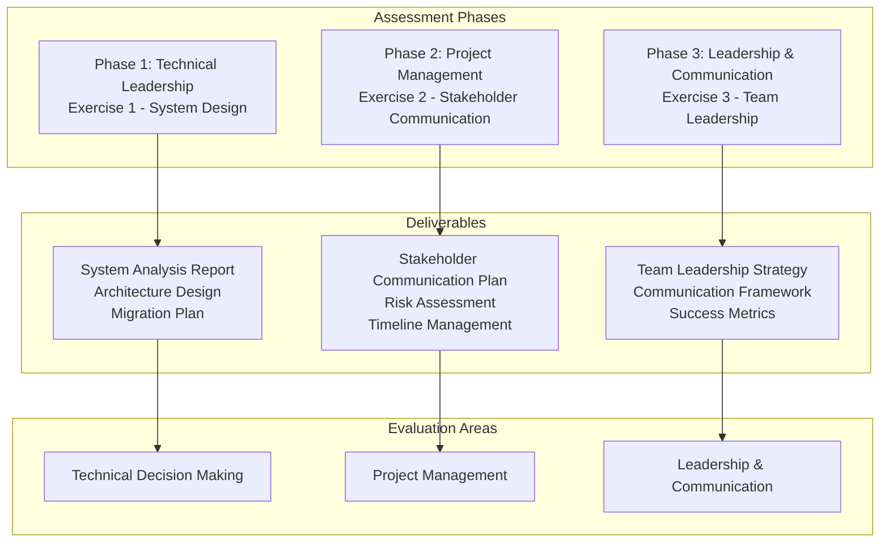

# Code Challenge: Engineering Manager & Technical Project Manager Assessment

**Objective:**

Demonstrate your leadership, technical decision-making, and project management skills through focused exercises that simulate real-world engineering management scenarios. This challenge evaluates your ability to lead teams, make technical decisions, manage projects, and communicate effectively across stakeholders.

## Assessment Overview

This assessment evaluates your capabilities as an Engineering Manager or Technical Project Manager through three focused exercises that simulate real-world scenarios you would encounter in these roles.

### Assessment Process:

## Challenge Overview

You will complete **two core exercises** that assess your capabilities as an Engineering Manager or Technical Project Manager. The assessment focuses on technical problem-solving and stakeholder communication in realistic scenarios.

## Requirements:

### Exercise 1: Technical System Design & Migration Planning (2-3 days)

#### Scenario: E-commerce Platform Scaling Challenge
Your company's e-commerce platform is experiencing performance issues after a 3× user increase. The current monolithic architecture is struggling to handle the load, and you need to design a scalable solution.

#### Deliverables:
- **System Analysis Report** (max 3 pages): Current bottlenecks and performance issues
- **Architecture Design** (max 2 pages): Proposed solution with trade-offs
- **Migration Plan** (max 2 pages): Implementation strategy and timeline
- **Risk Assessment** (1 page): Top 3 risks with mitigation strategies
- **Success Metrics** (1 page): KPIs and monitoring approach

#### Supporting Materials:
- See [Exercise 1 Materials](exercise1-materials.md) for detailed scenario, current architecture diagram, and requirements
- See [Exercise 1 Templates](exercise1-templates.md) for report templates and guidelines

### Exercise 2: Stakeholder Communication & Project Management (1-2 days)

#### Scenario: Critical Feature Launch Delay
A high-priority customer feature is behind schedule due to technical challenges. You need to communicate the situation to different stakeholders and propose a path forward.

#### Deliverables:
- **Executive Brief** (max 2 pages): 5-minute presentation for C-level stakeholders
- **Technical Update** (max 2 pages): Detailed explanation for engineering team
- **Customer Communication** (max 1 page): Status update for external stakeholders
- **Mitigation Plan** (max 2 pages): Path forward with timeline adjustments
- **Communication Strategy** (1 page): Ongoing update and escalation plan

#### Supporting Materials:
- See [Exercise 2 Materials](exercise2-materials.md) for detailed scenario, stakeholder profiles, and requirements
- See [Exercise 2 Templates](exercise2-templates.md) for presentation templates and communication guidelines

## Technical Requirements:

### Exercise 1 Requirements:
- **Architecture Diagrams**: Visual representation of current and proposed systems
- **Technical Documentation**: Clear design decisions and trade-offs
- **Implementation Timeline**: Realistic project schedule (max 6 months)
- **Resource Requirements**: Team size and skills needed
- **Risk Matrix**: Probability and impact assessment

### Exercise 2 Requirements:
- **Presentation Materials**: Slides and talking points for stakeholder presentations
- **Communication Templates**: Email templates and meeting agendas
- **Stakeholder Map**: Key stakeholders and their influence/interest levels
- **Escalation Procedures**: Issue resolution and escalation protocols

## Evaluation Criteria:

### Technical Leadership (50%):
- **System Design**: Architecture quality and scalability thinking
- **Problem Solving**: Analytical approach and technical decision-making
- **Technical Communication**: Ability to explain complex concepts clearly
- **Risk Management**: Technical risk identification and mitigation
- **Implementation Planning**: Realistic and actionable plans

### Leadership & Communication (50%):
- **Stakeholder Management**: Effective communication across different audiences
- **Strategic Thinking**: Big-picture thinking and business alignment
- **Decision Making**: Sound judgment and trade-off analysis
- **Written Communication**: Clear, concise, and professional documentation
- **Presentation Skills**: Engaging and informative presentations

## Timeline:

This challenge is designed to be completed in **3-5 business days**:

#### **Days 1-2: Technical System Design**
- Analyze current system architecture and identify bottlenecks
- Design scalable solution with trade-offs analysis
- Create implementation plan and risk assessment
- Define success metrics and monitoring approach

#### **Days 3-4: Stakeholder Communication**
- Develop executive brief and technical update
- Create customer communication and mitigation plan
- Design communication strategy and escalation procedures
- Prepare presentation materials and templates

#### **Day 5: Final Review & Submission**
- Review and refine all deliverables
- Ensure consistency across all materials
- Prepare final submission package
- Complete self-assessment and reflection

## Deliverables:

### Exercise 1 Deliverables:
- **System Analysis Report**: Current bottlenecks and performance issues
- **Architecture Design**: Proposed solution with trade-offs
- **Migration Plan**: Implementation strategy and timeline
- **Risk Assessment**: Top 3 risks with mitigation strategies
- **Success Metrics**: KPIs and monitoring approach

### Exercise 2 Deliverables:
- **Executive Brief**: 5-minute presentation for C-level stakeholders
- **Technical Update**: Detailed explanation for engineering team
- **Customer Communication**: Status update for external stakeholders
- **Mitigation Plan**: Path forward with timeline adjustments
- **Communication Strategy**: Ongoing update and escalation plan

## Assessment Format:

### Submission Requirements:
- **Written Documentation**: Professional reports and documentation
- **Presentation Materials**: Slides and talking points for stakeholder presentations
- **Visual Aids**: Diagrams, charts, and process flows
- **Supporting Materials**: Templates, checklists, and reference materials

### Evaluation Process:
- **Technical Review**: Assessment by senior engineers and architects
- **Leadership Review**: Evaluation by engineering managers and directors
- **Communication Review**: Assessment by product and business stakeholders
- **Final Presentation**: Live presentation and Q&A session (team/technical interview)

## Best Practices:

### Technical Leadership:
- **Data-Driven Decisions**: Use metrics and evidence to support recommendations
- **Scalability Thinking**: Consider future growth and system evolution
- **Trade-off Analysis**: Clearly articulate pros and cons of different approaches
- **Best Practices**: Apply industry standards and proven methodologies
- **Realistic Planning**: Create achievable timelines and resource estimates

### Leadership & Communication:
- **Empathy**: Understand and address stakeholder concerns and motivations
- **Clarity**: Communicate complex information clearly and concisely
- **Adaptability**: Adjust communication style for different audiences
- **Influence**: Build consensus and drive decisions without authority
- **Strategic Thinking**: Align technical solutions with business objectives

## Questions?

Any questions you may have, please contact us by e-mail.

Good luck! 🚀