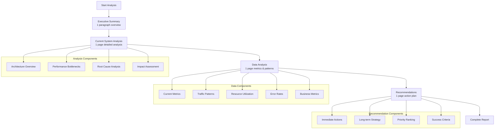

# Exercise 1: Templates and Guidelines

## Report Templates

### System Analysis Report Template

**Executive Summary** (1 paragraph)
- Brief overview of current situation and key findings
- Main performance bottlenecks identified
- Business impact summary

**Current System Analysis** (1 page)
- **Architecture Overview**: Current system components and interactions
- **Performance Bottlenecks**: Detailed analysis of each bottleneck
  - Database performance issues
  - Application performance issues
  - Infrastructure constraints
- **Root Cause Analysis**: Why these issues are occurring
- **Impact Assessment**: Business and technical impact

**Data Analysis** (1 page)
- **Current Metrics**: Specific performance measurements
- **Traffic Patterns**: User behavior and load patterns
- **Resource Utilization**: CPU, memory, database usage
- **Error Rates**: System errors and failures
- **Business Metrics**: Revenue impact, customer satisfaction

**Recommendations** (1 page)
- **Immediate Actions**: Quick wins and short-term fixes
- **Long-term Strategy**: Architectural changes needed
- **Priority Ranking**: What to address first
- **Success Criteria**: How to measure improvement

### Report Structure Flow:

### Architecture Design Template

**Proposed Solution Overview** (1 page)
- **High-Level Architecture**: Diagram and description of new system
- **Technology Stack**: Selected technologies with justification
- **Scalability Strategy**: How the solution will handle growth
- **Key Components**: Main services and their responsibilities

**Technology Choices** (1 page)
- **Microservices vs Monolith**: Decision and rationale
- **Database Strategy**: Primary and caching databases
- **Caching Strategy**: Multi-layer caching approach
- **Infrastructure**: Cloud services and deployment strategy
- **Monitoring**: Observability and alerting tools

**Trade-offs Analysis**
- **Pros and Cons**: Benefits and drawbacks of chosen approach
- **Alternative Options**: Other approaches considered
- **Decision Factors**: Key factors influencing decisions
- **Risk Assessment**: Technical risks of chosen approach

### Migration Plan Template

**Implementation Strategy** (1 page)
- **Migration Approach**: Strangler fig, big bang, or incremental
- **Phase Breakdown**: Major phases of the migration
- **Dependencies**: Critical dependencies between phases
- **Rollback Strategy**: How to revert if issues occur

**Timeline** (1 page)
- **Phase 1**: Infrastructure setup and basic services (Months 1-2)
- **Phase 2**: Core services migration (Months 3-4)
- **Phase 3**: Advanced features and optimization (Months 5-6)
- **Milestones**: Key deliverables and checkpoints
- **Critical Path**: Activities that cannot be delayed

**Resource Allocation**
- **Team Structure**: Roles and responsibilities
- **Skills Required**: Technical skills needed for each phase
- **External Dependencies**: Third-party services and vendors
- **Budget Breakdown**: Cost allocation across phases

### Risk Assessment Template

**Risk Matrix**

| Risk | Probability | Impact | Mitigation Strategy |
|------|-------------|--------|-------------------|
| Risk 1 | High/Medium/Low | High/Medium/Low | Specific actions |
| Risk 2 | High/Medium/Low | High/Medium/Low | Specific actions |
| Risk 3 | High/Medium/Low | High/Medium/Low | Specific actions |

**Detailed Risk Analysis**
- **Risk 1**: Description, probability, impact, mitigation
- **Risk 2**: Description, probability, impact, mitigation
- **Risk 3**: Description, probability, impact, mitigation

**Contingency Plans**
- **Plan A**: Primary mitigation strategy
- **Plan B**: Backup approach if Plan A fails
- **Escalation Procedures**: When and how to escalate

### Success Metrics Template

**Technical KPIs**
- **Performance Metrics**: Response times, throughput, error rates
- **Infrastructure Metrics**: Resource utilization, availability
- **Database Metrics**: Query performance, connection usage
- **Monitoring Strategy**: Tools and dashboards

**Business KPIs**
- **User Experience**: Page load times, bounce rates
- **Revenue Impact**: Cart abandonment, conversion rates
- **Customer Satisfaction**: Support tickets, ratings
- **Operational Efficiency**: Development velocity, deployment frequency

**Monitoring and Alerting**
- **Key Metrics**: What to monitor and why
- **Alert Thresholds**: When to trigger alerts
- **Reporting**: How to track and report progress
- **Review Process**: Regular review and adjustment

## Guidelines for Each Deliverable

### System Analysis Report Guidelines

**Focus Areas:**
- **Data-Driven Analysis**: Use specific metrics and measurements
- **Root Cause Identification**: Go beyond symptoms to underlying causes
- **Business Impact**: Connect technical issues to business outcomes
- **Prioritization**: Rank issues by impact and urgency

**Writing Tips:**
- Use clear, concise language
- Include specific numbers and percentages
- Provide evidence to support conclusions
- Focus on actionable insights

### Architecture Design Guidelines

**Design Principles:**
- **Scalability**: Design for future growth
- **Reliability**: Ensure high availability and fault tolerance
- **Maintainability**: Consider long-term maintenance
- **Cost Efficiency**: Balance performance with cost

**Documentation Standards:**
- Include clear architecture diagrams
- Explain technology choices with rationale
- Address security and compliance requirements
- Consider operational aspects

### Migration Plan Guidelines

**Planning Principles:**
- **Risk Mitigation**: Minimize business disruption
- **Incremental Approach**: Break down into manageable phases
- **Testing Strategy**: Comprehensive testing at each phase
- **Communication Plan**: Keep stakeholders informed

**Implementation Considerations:**
- **Data Migration**: Ensure data integrity and zero loss
- **Downtime Planning**: Minimize service interruption
- **Team Coordination**: Clear roles and responsibilities
- **Quality Assurance**: Testing and validation procedures

### Risk Assessment Guidelines

**Risk Categories:**
- **Technical Risks**: Technology failures, performance issues
- **Operational Risks**: Process failures, resource constraints
- **Business Risks**: Market changes, stakeholder concerns
- **External Risks**: Vendor issues, regulatory changes

**Assessment Framework:**
- **Probability**: Likelihood of risk occurring (High/Medium/Low)
- **Impact**: Severity of consequences (High/Medium/Low)
- **Mitigation**: Specific actions to reduce risk
- **Monitoring**: How to track risk indicators

### Success Metrics Guidelines

**SMART Criteria:**
- **Specific**: Clear, unambiguous metrics
- **Measurable**: Quantifiable and trackable
- **Achievable**: Realistic and attainable
- **Relevant**: Aligned with business objectives
- **Time-bound**: Specific timeframe for achievement

**Measurement Strategy:**
- **Baseline**: Current performance levels
- **Targets**: Specific goals to achieve
- **Frequency**: How often to measure
- **Reporting**: How to communicate results

## Common Pitfalls to Avoid

### System Analysis
- **Symptom vs Cause**: Don't just describe symptoms, identify root causes
- **Missing Data**: Include specific metrics and measurements
- **No Prioritization**: Rank issues by importance and urgency
- **Ignoring Business Impact**: Connect technical issues to business outcomes

### Architecture Design
- **Over-Engineering**: Don't over-complicate the solution
- **Technology Hype**: Choose proven technologies over trendy ones
- **Missing Trade-offs**: Always discuss pros and cons
- **No Scalability Plan**: Consider future growth requirements

### Migration Planning
- **Unrealistic Timeline**: Don't underestimate complexity
- **No Rollback Plan**: Always have a backup strategy
- **Missing Dependencies**: Identify all critical dependencies
- **Poor Communication**: Plan stakeholder communication

### Risk Assessment
- **Generic Risks**: Be specific about risks and their context
- **No Mitigation**: Don't just identify risks, provide solutions
- **Missing Monitoring**: Plan how to track risk indicators
- **Unrealistic Mitigation**: Ensure mitigation strategies are feasible

### Success Metrics
- **Vague Metrics**: Use specific, measurable indicators
- **No Baseline**: Establish current performance levels
- **Missing Targets**: Set clear goals for improvement
- **No Monitoring Plan**: Plan how to track and report metrics 