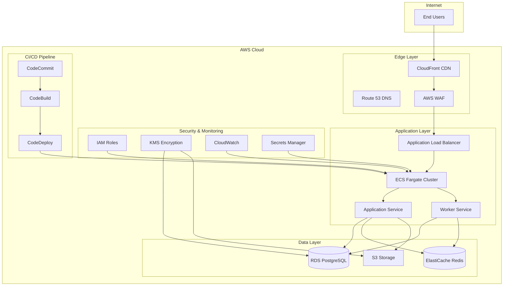

# Code Challenge: Cloud Platform Engineering

**Objective:**

Design and implement a production-ready AWS infrastructure for one of three applications: Twenty CRM, LiteLLM Proxy, or N8N. This challenge assesses your ability to architect, deploy, and manage cloud infrastructure with modern DevOps practices and infrastructure as code.

## Application Choices:

Choose **ONE** of the following applications to deploy:

#### Option 1: Twenty CRM
- **Purpose**: Customer Relationship Management platform
- **Technology**: React frontend, Node.js backend, PostgreSQL database
- **Features**: Contact management, sales pipeline, analytics dashboard
- **Complexity**: Medium (3 services: frontend, backend, database)

#### Option 2: LiteLLM Proxy
- **Purpose**: Unified API gateway for multiple LLM providers
- **Technology**: Python FastAPI, PostgreSQL, Redis
- **Features**: Model routing, cost tracking, rate limiting
- **Complexity**: Medium (3 services: API, database, cache)

#### Option 3: N8N
- **Purpose**: Workflow automation platform
- **Technology**: Node.js, PostgreSQL, Redis
- **Features**: Visual workflow builder, 200+ integrations
- **Complexity**: High (4 services: web, worker, database, cache)

#### Cloud Infrastructure Architecture:


## Requirements:

### Phase 1: Infrastructure Design & Core Deployment (2-3 days)

#### Infrastructure as Code (IaC):
- **Terraform or CloudFormation**: Basic infrastructure provisioning
- **Modular Design**: Organized, reusable components
- **Environment Management**: Single production environment
- **State Management**: Basic Terraform state management or CloudFormation stacks
- **Variable Management**: Environment-specific configurations

#### Core Infrastructure Components:
- **VPC Design**: Multi-AZ VPC with public and private subnets
- **Networking**: Security groups, route tables, internet/NAT gateways
- **Load Balancing**: Application Load Balancer with SSL/TLS termination
- **Auto Scaling**: Basic horizontal scaling policies
- **Database**: RDS PostgreSQL with basic configuration
- **Caching**: ElastiCache Redis (for LiteLLM and N8N)
- **Storage**: S3 buckets for file storage
- **Basic Monitoring**: CloudWatch for essential metrics

#### Application-Specific Infrastructure:

##### For Twenty CRM:
- **ECS Fargate**: Container orchestration for Twenty server and worker
- **RDS PostgreSQL**: Database with basic security
- **S3**: File storage for attachments and documents

##### For LiteLLM Proxy:
- **ECS Fargate**: Container orchestration for LiteLLM proxy
- **RDS PostgreSQL**: Database for user management and request logging
- **ElastiCache Redis**: Caching layer for responses and sessions

##### For N8N:
- **ECS Fargate**: Container orchestration for N8N web and worker nodes
- **RDS PostgreSQL**: Database for workflow storage and execution history
- **ElastiCache Redis**: Caching and queue management

### Phase 2: DevOps & Security Implementation (1-2 days)

#### Basic CI/CD Pipeline:
- **GitHub Actions or AWS CodePipeline**: Simple automated deployment pipeline
- **Container Registry**: ECR for Docker image management
- **Basic Security**: Container vulnerability scanning
- **Testing**: Basic infrastructure testing

#### Configuration Management:
- **Secrets Management**: AWS Secrets Manager for sensitive data
- **Parameter Store**: Basic application configuration management
- **Environment Variables**: Secure environment variable handling

#### Monitoring & Observability:
- **Logging**: Basic CloudWatch Logs setup
- **Metrics**: Essential CloudWatch metrics and dashboards
- **Alerting**: Basic automated alerting for critical issues
- **Health Checks**: Application and infrastructure health monitoring

#### Security Implementation:
- **IAM**: Basic least privilege access with role-based permissions
- **Encryption**: Data encryption at rest and in transit
- **Network Security**: VPC security and basic WAF rules
- **Backup**: Basic automated backup procedures

## Technical Requirements:

### Infrastructure Architecture:
```
┌─────────────────┐    ┌─────────────────┐    ┌─────────────────┐
│   Internet      │    │   ALB + WAF     │    │   ECS Fargate   │
│                 │───▶│                 │───▶│   (Containers)  │
│                 │    │                 │    │                 │
└─────────────────┘    └─────────────────┘    └─────────────────┘
                                │                       │
                                ▼                       ▼
                       ┌─────────────────┐    ┌─────────────────┐
                       │   S3 Storage    │    │   RDS + Redis   │
                       │   + Backups     │    │   (Database)    │
                       └─────────────────┘    └─────────────────┘
                                │
                                ▼
                       ┌─────────────────┐
                       │   CloudWatch    │
                       │   + Monitoring  │
                       └─────────────────┘
```

### Technology Stack:
- **IaC**: Terraform or CloudFormation
- **Container Orchestration**: ECS Fargate
- **Database**: RDS PostgreSQL
- **Caching**: ElastiCache Redis (for LiteLLM and N8N)
- **Storage**: S3
- **Load Balancing**: ALB with SSL termination
- **Monitoring**: CloudWatch
- **CI/CD**: GitHub Actions or AWS CodePipeline

### Application-Specific Configurations:

#### Twenty CRM Configuration:
```yaml
# docker-compose.yml
version: '3.8'
services:
  twenty-server:
    image: twentyhq/twenty-server:latest
    environment:
      - APP_SECRET=${APP_SECRET}
      - SERVER_URL=${SERVER_URL}
      - PGPASSWORD_SUPERUSER=${PGPASSWORD_SUPERUSER}
    volumes:
      - twenty-data:/app/storage
    depends_on:
      - postgres

  twenty-worker:
    image: twentyhq/twenty-worker:latest
    environment:
      - APP_SECRET=${APP_SECRET}
      - PGPASSWORD_SUPERUSER=${PGPASSWORD_SUPERUSER}
    depends_on:
      - postgres

  postgres:
    image: postgres:15
    environment:
      - POSTGRES_PASSWORD=${PGPASSWORD_SUPERUSER}
    volumes:
      - postgres-data:/var/lib/postgresql/data

volumes:
  twenty-data:
  postgres-data:
```

#### LiteLLM Configuration:
```yaml
# litellm-config.yaml
model_list:
  - model_name: gpt-4o
    litellm_params:
      model: azure/gpt-4o
      api_base: os.environ/AZURE_API_BASE
      api_key: os.environ/AZURE_API_KEY
      api_version: "2025-01-01-preview"

general_settings:
  master_key: os.environ/LITELLM_MASTER_KEY
  database_url: os.environ/DATABASE_URL
  redis_url: os.environ/REDIS_URL
  block_robots: true

litellm_settings:
  drop_params: true
```

#### N8N Configuration:
```yaml
# docker-compose.yml
version: '3.8'
services:
  n8n:
    image: n8nio/n8n:latest
    environment:
      - DB_TYPE=postgresdb
      - DB_POSTGRESDB_HOST=postgres
      - DB_POSTGRESDB_PORT=5432
      - DB_POSTGRESDB_DATABASE=n8n
      - DB_POSTGRESDB_USER=n8n
      - DB_POSTGRESDB_PASSWORD=${DB_PASSWORD}
      - REDIS_HOST=redis
      - REDIS_PORT=6379
      - N8N_BASIC_AUTH_ACTIVE=true
      - N8N_BASIC_AUTH_USER=${N8N_USER}
      - N8N_BASIC_AUTH_PASSWORD=${N8N_PASSWORD}
    volumes:
      - n8n_data:/home/node/.n8n
    depends_on:
      - postgres
      - redis

  n8n-worker:
    image: n8nio/n8n:latest
    environment:
      - DB_TYPE=postgresdb
      - DB_POSTGRESDB_HOST=postgres
      - DB_POSTGRESDB_PORT=5432
      - DB_POSTGRESDB_DATABASE=n8n
      - DB_POSTGRESDB_USER=n8n
      - DB_POSTGRESDB_PASSWORD=${DB_PASSWORD}
      - REDIS_HOST=redis
      - REDIS_PORT=6379
      - EXECUTIONS_MODE=worker
    depends_on:
      - postgres
      - redis

  postgres:
    image: postgres:15
    environment:
      - POSTGRES_DB=n8n
      - POSTGRES_USER=n8n
      - POSTGRES_PASSWORD=${DB_PASSWORD}
    volumes:
      - postgres_data:/var/lib/postgresql/data

  redis:
    image: redis:7-alpine
    volumes:
      - redis_data:/data

volumes:
  n8n_data:
  postgres_data:
  redis_data:
```

## Deliverables:

### Phase 1 Deliverables:
- **Infrastructure as Code**: Complete Terraform or CloudFormation templates
- **Architecture Diagram**: Infrastructure design overview
- **Application Deployment**: Working application deployment
- **Basic Documentation**: Setup and configuration guide

### Phase 2 Deliverables:
- **CI/CD Pipeline**: Basic automated deployment pipeline
- **Security Implementation**: Essential security controls
- **Monitoring Setup**: Basic dashboards and alerting
- **Final Documentation**: Complete deployment and operation guide

## Evaluation Criteria:

### Infrastructure Design (40%):
- **Architecture Quality**: Scalable and secure design
- **IaC Quality**: Clean, modular, and reusable code
- **Best Practices**: AWS well-architected framework compliance
- **Documentation**: Clear and comprehensive documentation

### DevOps Implementation (35%):
- **CI/CD Pipeline**: Automated and reliable deployment process
- **Configuration Management**: Secure configuration handling
- **Monitoring**: Essential observability and alerting
- **Testing**: Basic infrastructure and application testing

### Security & Operations (25%):
- **Security Controls**: Essential security implementation
- **Backup & Recovery**: Basic disaster recovery capabilities
- **Cost Management**: Resource optimization and cost control
- **Operational Excellence**: Production-ready deployment

## Timeline:

This challenge is designed to be completed in **3-5 business days**:

#### **Days 1-2: Infrastructure Design & Core Deployment**
- Choose application and design architecture
- Create infrastructure as code templates
- Deploy core infrastructure components
- Configure application-specific services

#### **Days 3-4: DevOps & Security Implementation**
- Implement CI/CD pipeline
- Configure security controls
- Set up monitoring and logging
- Deploy and test application

#### **Day 5: Testing & Documentation**
- Final testing and validation
- Performance optimization
- Complete documentation
- Final review and submission

## Priority Focus Areas:

#### **Must Complete (High Priority):**
- Core infrastructure deployment
- Application deployment and configuration
- Basic CI/CD pipeline
- Essential security controls
- Basic monitoring and logging setup

#### **Should Complete (Medium Priority):**
- Advanced security features
- Performance optimization
- Comprehensive monitoring
- Cost optimization
- Basic testing implementation

#### **Nice to Have (Low Priority):**
- Advanced CI/CD features
- Disaster recovery automation
- Advanced monitoring and alerting
- Performance benchmarking
- Detailed cost analysis

## Questions?

Any questions you may have, please contact us by e-mail.

Good luck! 🚀
